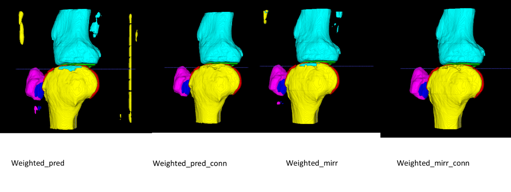

# K2S Patch-Based Knee Segmentation

This repository contains the code for the MICCAI 2022 challenge, "From Undersampled K-space to Automatic Segmentation," focused on knee MRI data.

## Introduction

The K2S challenge aimed to improve knee MRI segmentation using deep learning on 8x undersampled k-space data, integrating reconstruction and segmentation into an end-to-end approach. 

For more details, explore the following resources:
- **[K2S Challenge Website](https://k2s.grand-challenge.org/)**: Information about the challenge, dataset, and participants.
- **[Publication](https://doi.org/10.3390/bioengineering10020267)**: Full academic paper detailing the challenge and methodologies.
- **[MICCAI 2022 Presentation (PDF)](figures/K2S-MICCAI-2022-Presentation-Quintin-Stefan.pdf)**: Slides presented at MICCAI 2022, providing an overview of the project and results.

### Key Features:
- **Data Preprocessing:** Transforming raw k-space MRI data into formats suitable for AI models.
- **Model Training:** Employing patch-based 3D U-Net models for precise tissue segmentation.
- **Post-Processing:** Refining segmentation results with advanced post-processing techniques.

---

## Data Preparation

### 1. `e1`: Extract and Convert Data
This script extracts compressed `.gz` files and generates `.h5` files for each patient. The `.h5` files contain both segmentation data and k-space data, which are extracted and stored as NumPy arrays for faster processing later.

### 2. `e2`: Generate Path File
This script creates a text file listing paths to segmentations and k-space files, for data access throughout the project.

### 3. `e3`: Create Train/Val/Test Splits
This script generates indexes for training, validation, and test sets, supporting 10-fold cross-validation. The output is a YAML file with indexes for each split.

### 4. `e4`: Load RSS Reconstructions and Segmentations
This script loads RSS-reconstructed MRI data as training data and the corresponding segmentations as labels. It prepares the data for training segmentation models using predefined hyperparameters.

### 5. `e5`: Reconstruct Images from K-space
This script reconstructs images from k-space data using the root sum of squares (RSS) method. It processes each coil image in parallel, applies the reconstruction, and saves the resulting images.

### 6. `e6`: Calculate Segmentation Histograms
This script calculates histograms for each label in the segmentation or prediction data, supporting parallel processing. The histograms provide insight into the distribution of different tissue types within the segmented images.

### 7. `e7`: Perform Sliding Window Predictions
This script loads validation data and applies a trained model to generate predictions using a sliding window approach. It is particularly useful for handling large images where direct segmentation might be computationally expensive.

### 8. `e8`: Sliding Window Predictions (Alternative)
This script is another version for performing sliding window predictions on validation data. It functions similarly to `e7` but has slight variations in its implementation.

### 9. `e9`: Train Model with RSS Reconstructions
This script prepares the training dataset by loading RSS reconstruction data and segmentations. It then trains a segmentation model using hyperparameters defined in prior research.

### 10. (Deleted)

### 11. `e11`: Multi-Coil Image Generation
This script reads multi-coil k-space data, generates images for each coil, and writes them to the scratch directory on computing cluster. It is essential for preparing data for subsequent processing steps.

### 12. `e12`: Post-Processing of Segmentation Predictions
This script is crucial for refining the segmentation predictions generated by the sliding window approach. The post-processing steps ensure that the final segmentation outputs are not only accurate but also clinically meaningful. This stage includes several advanced techniques, each designed to enhance different aspects of the segmentation.

#### Detailed Steps:

- **Mirror Padding**: 
  - **Purpose**: Mirror padding is used to improve prediction accuracy at the edges of an image, where limited context can lead to less reliable segmentation.
  - **Implementation**: The script extends the image data at the borders by mirroring it, providing the model with additional context, resulting in smoother and more accurate edge predictions.

- **Connected Components Analysis**: 
  - **Purpose**: This step identifies and removes small, isolated segments that are likely to be noise or false positives, especially in complex anatomical regions.
  - **Implementation**: The script labels all connected regions (components) in the binary segmentation mask and filters out those below a certain size threshold.
  - **Effect**: This process significantly reduces the presence of spurious segmentations, leading to cleaner and more reliable results.

- **Self-Ensembling**: 
  - **Purpose**: Self-ensembling is used to stabilize the segmentation predictions by averaging results from overlapping patches.
  - **Implementation**: The script generates multiple overlapping predictions for each voxel by sliding the window across the image, then averages these predictions to form the final output. This reduces variability and improves the robustness of the segmentation.
  - **Formula**: The final prediction for a voxel can be represented as:

    `ŷ = (1/N) * Σ(yᵢ)`

    where `N` is the number of overlapping predictions and `yᵢ` is the prediction from the i-th window.

- **Weighted Dice Loss Application**: 
  - **Purpose**: This step adjusts the segmentation based on the weighted Dice coefficient, ensuring accuracy across different tissue types, especially smaller structures like cartilage.
  - **Implementation**: During training, a weighted Dice loss function was applied. This approach revisits those weights to enhance the segmentation of crucial structures in the final output.
  - **Formula**: The weighted Dice loss is calculated as follows:

    

    - `N` = Number of pixels
    - `p` = Prediction
    - `g` = Ground Truth
    - `ω = [1, 2, 2, 2, 1, 1, 1]` where weights are assigned to the background, cartilages, and bones respectively.

    The weighted version adjusts the contribution of different classes based on their size and clinical importance.

### 13. `e13`: Generate Submission File
This script generates the submission file required for the K2S challenge. It ensures that the results are formatted correctly and ready for evaluation.

### 14. `e14`: Validate Submission File
This script validates the submission file to ensure that it meets the challenge's requirements and is free from errors.

---

## Results

### Segmentation Examples
Below are examples of the segmentation results obtained using our pipeline. These include the original MRI scans, the initial segmentation predictions, the application of weighted Dice loss, and the refined post-processed segmentation outputs.

- **Original and Undersampled MRI Image:**

  
  
  *Figure 1: Comparison of fully sampled and 8x undersampled MRI data, which serve as the input for the segmentation pipeline.*

- **Initial Segmentation Prediction:**
  
  *Figure 2: The raw segmentation predictions generated by the model before any post-processing steps are applied.*

- **Application of Weighted Dice Loss:**
  
  *Figure 3: Visualization of the effect of applying the weighted Dice coefficient during training, which helps improve segmentation accuracy for smaller anatomical structures.*

- **Post-Processed Segmentation (Step 1):**
  
  *Figure 4: Intermediate post-processing results showing initial refinement of segmentation predictions.*

- **Final Post-Processed Segmentation:**
  
  *Figure 5: Final segmentation output after completing all post-processing steps, highlighting accurate and clinically relevant tissue boundaries.*

### Performance Metrics
The pipeline demonstrated robust performance, achieving a mean Dice coefficient of approximately 0.92 across different tissue types. This performance was consistent even when using 8x undersampled k-space data, validating the effectiveness of the approach.

- **Boxplot of Dice Coefficients for Different Tissues:**
  
  *Figure 6: Boxplot showing the distribution of Dice coefficients across different tissue types, highlighting the consistency and reliability of the segmentation results.*

